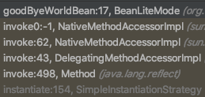
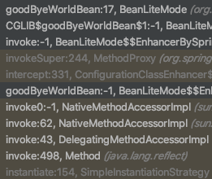

bean annotation 문서를 보던 도중, bean lite mode라는 친구가 있었습니다. 이와 반대되는 친구로는 bean full mode가 있는데요. \
bean full mode의 경우에는 우리가 평소 사용하는 방식입니다.(Configuration 어노테이션에 별도 설정없이 사용) 그렇다면 bean lite mode는 무엇이고, 어떻게 설정하고, 무슨 용도로 사용되는걸까요?

## bean lite mode란

bean lite mode는 'inter-bean references'를 지원하지 않고 그 이외에는 bean full mode와 동일하게 동작한다고 합니다. 즉, 동일하게 bean으로 등록되고 bean lifecycle과 관련된 콜백들이 똑같이 호출됩니다.(자세한 내용은 [링크](https://docs.spring.io/spring-framework/docs/5.3.4/javadoc-api/org/springframework/context/annotation/Bean.html)를 확인해주세요.)

## bean lite mode 설정 방법

bean lite mode는 Configuration 어노테이션의 proxyBeanMethods를 false로 설정하거나 Configuration 이외의 클래스에서 bean 메소드를 작성하면 됩니다.

```java
@Configuration(proxyBeanMethods = false)
public class Test {
  @Bean
  public HelloWorldBean helloWorldBean() {
    return new HelloWorldBean();
  }

  public class HelloWorldBean implements InitializingBean {
    @Override
    public void afterPropertiesSet() throws Exception {
      System.out.println("hello world!");
    }
  }
}
```

```sh
2021-03-17 21:01:26.794  INFO 5612 --- [  restartedMain] j.LocalContainerEntityManagerFactoryBean : Initialized JPA EntityManagerFactory for persistence unit 'default'
hello world!
2021-03-17 21:01:27.468  INFO 5612 --- [  restartedMain] o.s.s.concurrent.ThreadPoolTaskExecutor  : Initializing ExecutorService 'applicationTaskExecutor'
```

위와 같이 정상적으로 빈이 등록되고, hello world! 메세지가 출력된 것을 확인할 수 있습니다.

## inter-bean references을 지원하지 않는다는게 무슨 뜻일까?

goodByeWorldBean이 빈으로 등록되는 과정에서 어떤 문자열을 출력할까요?

```java
@Configuration(proxyBeanMethods = true)
public class BeanLiteMode {

  @Bean
  public HelloWorldBean helloWorldBean() {
    return new HelloWorldBean();
  }

  @Bean
  public GoodByeWorldBean goodByeWorldBean() {
    GoodByeWorldBean a = new GoodByeWorldBean(helloWorldBean());
    GoodByeWorldBean b = new GoodByeWorldBean(helloWorldBean());
    if(a.getHelloWorldBean() == b.getHelloWorldBean()) {
      System.out.println("same reference");
    } else {
      System.out.println("different reference");
    }
    return a;
  }

  public class HelloWorldBean implements InitializingBean {
    @Override
    public void afterPropertiesSet() throws Exception {
      System.out.println("hello world!");
    }
  }

  public class GoodByeWorldBean {
    private HelloWorldBean helloWorldBean;

    public GoodByeWorldBean(HelloWorldBean helloWorldBean) {
      this.helloWorldBean = helloWorldBean;
    }

    public HelloWorldBean getHelloWorldBean() {
      return helloWorldBean;
    }
  }
}
```

결과는 'same reference'를 출력합니다. 여기서 proxyBeanMethods = true를 false로 바꾸면 'different reference'가 출력되는 것을 확인할 수 있습니다. \
즉, spring에서는 bean scope가 singleton이고 bean full mode(proxyBeanMethods = true)인 경우에는 proxy를 이용하여 bean 메소드가 호출될 때 해당 객체가 singleton임을 보장합니다. \
즉 우리가 직접 bean 메소드를 호출했던 것을 getBean 메소드를 통해 bean을 얻을 수 있도록 바꿔줍니다. bean lite mode에서는 이를 보장하지 않습니다. \
따라서 bean lite mode에서는 이로 인해 찾기 어려운 버그가 발생할 수 있습니다.

## 그러면 bean lite mode를 사용 안하면 되지 않나?

bean lite mode를 사용하면 성능 상의 이점을 얻을 수 있습니다.



bean lite mode의 call stack과



bean full mode의 call stack을 보시면 차이가 있다는 것을 알 수 있는데요. proxy 생성을 위한 비용 및 호출할 때 단계가 줄어들어 bean 생성을 좀 더 빠르게 할 수 있습니다. \
spring boot에서도 startup 시간을 개선하기 위해 autoconfigure 패키지에서 다음과 같이 bean lite mode를 사용하고 있습니다. (이와 관련된 깃헙 이슈는 해당 [링크](https://github.com/spring-projects/spring-boot/issues/9068)를 참고해주세요.)

```java
// org.springframework.boot.autoconfigure.web.servlet.DispatcherServletAutoConfiguration
@AutoConfigureOrder(Ordered.HIGHEST_PRECEDENCE)
@Configuration(proxyBeanMethods = false)
@ConditionalOnWebApplication(type = Type.SERVLET)
@ConditionalOnClass(DispatcherServlet.class)
@AutoConfigureAfter(ServletWebServerFactoryAutoConfiguration.class)
public class DispatcherServletAutoConfiguration {
    //...
}
```

## 결론

규모가 큰 프로젝트이고, bean 생성으로 인해 startup에 걸리는 시간이 크다면 bean lite mode 사용을 고려해보는 것도 나쁘지 않을 것으로 보입니다. \
그 이외의 경우라면 찾기 어려운 버그를 발생시킬 수 있는 bean lite mode 대신 bean full mode를 사용하는 것이 좋습니다.
