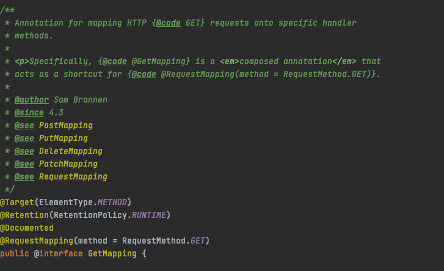
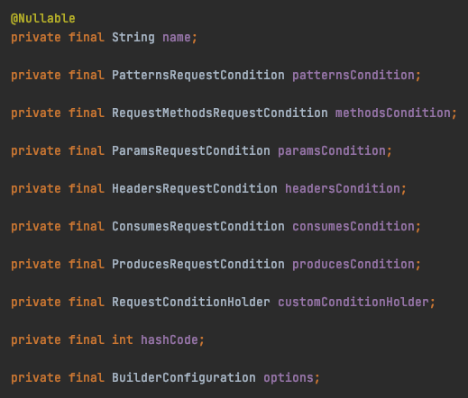

본 포스트는 spring 5.3.4을 기준으로 포스팅 되었습니다.

java & spring으로 API 개발을 하시는 개발자 분들이라면, RequestMapping 어노테이션을 많이 사용해 본 경험이 있지 않으시나요? 우리가 해당 어노테이션을 사용하여 작성한 클래스와 메소드는 적절히 spring framework에 의해 호출되어 요청에 맞는 응답을 생성합니다. 이 과정은 어떻게 진행되는 걸까요?

아, 참고로 GetMapping, PostMapping 등의 경우 RequestMapping 어노테이션의 method 필드에 값을 지정한 경우를 사용하기 편하게 만든 것입니다.



## spring webmvc 구조


spring webmvc documentation의 위 그림과 같이 front controller(dispatchServlet)을 이용하여 tomcat이 받은 모든 요청을 dispatcherServlet에서 넘긴 후 url pattern 및 각종 컨디션에 따라 적절히 우리가 작성한 컨트롤러 클래스의 메소드를 호출해줍니다. DispatcherServlet의 경우 이름에서 알 수 있듯이 servlet spec에 해당되는 servlet interface를 구현하고 있어 tomcat에 들어온 요청을 DispatcherServlet으로 위임하는 것이 가능합니다. \
그렇다면 우리가 작성한 코드는 어떻게 관리가 되고 호출되는걸까요?

## RequestMappingHandlerMapping & RequestMappingHandlerAdapter

RequestMapping을 처리하기 위해 RequestMappingHandlerMapping & RequestMappingHandlerAdapter 클래스를 사용하는데요. 해당 클래스들은 WebMvcConfigurationSupport에 @Bean으로 등록되어 있고 EnableWebMvc, Configuration 어노테이션을 설정하는 것을 통해 빈으로 등록됩니다. (그 이외에도 다른 빈들이 같이 있습니다.)

먼저 우리가 controller(RestController) 어노테이션을 붙여 작성한 클래스는 IoC Conta다iner에 의해 빈으로 등록됩니다.
그 후, 해당 클래스의 정보와 해당 클래스에 RequestMapping이 달린 메소드들은 RequestMappingHandlerMapping 객체의 mappingRegistry 필드에 HandlerMethod로 등록됩니다. \
RequestMappingInfo은 우리가 RequestMapping을 사용할 때 url pattern, request method, consume, produce 정보 등을 통해 해당 요청을 처리할 수 있는 메소드인지 파악할 때 사용되는 클래스입니다.



RequestMappingHandlerMapping 객체가 Ioc Container에 빈으로 등록되어 있다면 dispatcherServlet가 초기화될 때 initHandlerMappings 메소드를 통해 dispatcherServlet의 handlerMappings 필드에 추가됩니다.

RequestMappingHandlerAdapter는 RequestMapping을 처리하기 위해 필요한 argumentResolvers, initbinderresolvers, returnValueHandlers, messageConverters 등을 가지고 있습니다.

## 요청부터 우리가 작성한 메소드가 호출되기까지

tomcat에 들어온 요청은 dispatcherServlet servlet interface인 service 메소드를 시작으로 doHttpMethod(doGet, doPost, ...) -  processRequest - doService 메소드를 거쳐 doDispatch 메소드를 실행합니다.

```java
// org.springframework.web.servlet.DispatcherServlet
protected void doDispatch(HttpServletRequest request, HttpServletResponse response) throws Exception {
  HttpServletRequest processedRequest = request;
  HandlerExecutionChain mappedHandler = null;
  boolean multipartRequestParsed = false;

  WebAsyncManager asyncManager = WebAsyncUtils.getAsyncManager(request);

  try {
    ModelAndView mv = null;
    Exception dispatchException = null;

    try {
      processedRequest = checkMultipart(request);
      multipartRequestParsed = (processedRequest != request);

      // (1) - handlerMethod 반환(우리가 작성한 메소드와 빈 정보 반환)
      mappedHandler = getHandler(processedRequest); 
      if (mappedHandler == null) {
        noHandlerFound(processedRequest, response);
        return;
      }

      // (2) - handlerAdapter 반환(RequestMappingHandlerAdapter)
      HandlerAdapter ha = getHandlerAdapter(mappedHandler.getHandler()); 

      String method = request.getMethod();
      boolean isGet = "GET".equals(method);
      if (isGet || "HEAD".equals(method)) {
        long lastModified = ha.getLastModified(request, mappedHandler.getHandler());
        if (new ServletWebRequest(request, response).checkNotModified(lastModified) && isGet) {
          return;
        }
      }

      if (!mappedHandler.applyPreHandle(processedRequest, response)) {
        return;
      }

      // (3) - handle 메소드 호출
      mv = ha.handle(processedRequest, response, mappedHandler.getHandler()); 

      if (asyncManager.isConcurrentHandlingStarted()) {
        return;
      }

      applyDefaultViewName(processedRequest, mv);
      mappedHandler.applyPostHandle(processedRequest, response, mv);
    }
    catch (Exception ex) {
      dispatchException = ex;
    }
    catch (Throwable err) {
      dispatchException = new NestedServletException("Handler dispatch failed", err);
    }
    // (4) - 예외 처리, view rendering 등을 처리
    processDispatchResult(processedRequest, response, mappedHandler, mv, dispatchException);
  }
  catch (Exception ex) {
    triggerAfterCompletion(processedRequest, response, mappedHandler, ex);
  }
  catch (Throwable err) {
    triggerAfterCompletion(processedRequest, response, mappedHandler,
        new NestedServletException("Handler processing failed", err));
  }
  finally {
    if (asyncManager.isConcurrentHandlingStarted()) {
      if (mappedHandler != null) {
        mappedHandler.applyAfterConcurrentHandlingStarted(processedRequest, response);
      }
    }
    else {
      if (multipartRequestParsed) {
        cleanupMultipart(processedRequest);
      }
    }
  }
}
```

getHandler에서는 dispatcherServlet에 등록된 MappingHandler를 순회하며 해당 요청을 처리할 수 있는 handler에 등록된 intercepter를 포함하는 HandlerExecutionChain을 반환합니다. 여기서는 RequestMappingHandlerMapping가 Ioc Container에 등록되어 있고 RequestMappingHandlerMapping에 의해 등록된 handler 중 하나가 반환되었다고 가정하겠습니다.

이후 getHandlerAdapter 메소드를 통해 해당하는 handler에 맞는 handlerAdapter를 반환합니다.

```java
// org.springframework.web.servlet.DispatcherServlet
protected HandlerAdapter getHandlerAdapter(Object handler) throws ServletException {
  if (this.handlerAdapters != null) {
    for (HandlerAdapter adapter : this.handlerAdapters) {
      if (adapter.supports(handler)) {
        return adapter;
      }
    }
  }
  throw new ServletException("No adapter for handler [" + handler +
      "]: The DispatcherServlet configuration needs to include a HandlerAdapter that supports this handler");
}
```

각 adapter는 자신이 해당 handler를 처리할 수 있는지 여부를 supports 메소드를 호출하여 판단합니다. 마찬가지로 RequestMappingHandlerAdapter가 빈으로 등록되어 있고 RequestMappingHandlerAdapter가 반환되었다고 가정하겠습니다. \
참고로 RequestMappingHandlerAdapter의 경우 모든 handler를 어떤 형식으로든 자신이 처리 가능하다고 보고 supports 메소드에서 supportsInternal 메소드를 거쳐 true를 반환합니다.

handlerAdapter의 handle 메소드로 servlet 요청과 응답, 그리고 우리가 작성한 메소드 핸들러 형식으로 파라미터가 넘어갑니다. 그 이후 handleInternal - invokeHandlerMethod 메소드를 거치고 invokeHandlerMethod에서 핸들러는 ServletInvocableHandlerMethod으로 변환되어 invokeAndHandle 메소드를 호출합니다.

```java
// org.springframework.web.servlet.mvc.method.annotation.ServletInvocableHandlerMethod
public void invokeAndHandle(ServletWebRequest webRequest, ModelAndViewContainer mavContainer,
  Object... providedArgs) throws Exception {

  // (1) - 해당 메소드 내에서 argumentResolver에 의해 우리가 작성한 메소드의 argument에 맞게 파라미터가 resolving
  Object returnValue = invokeForRequest(webRequest, mavContainer, providedArgs); 
  setResponseStatus(webRequest);

  if (returnValue == null) {
    if (isRequestNotModified(webRequest) || getResponseStatus() != null || mavContainer.isRequestHandled()) {
      disableContentCachingIfNecessary(webRequest);
      mavContainer.setRequestHandled(true);
      return;
    }
  }
  else if (StringUtils.hasText(getResponseStatusReason())) {
    mavContainer.setRequestHandled(true);
    return;
  }

  // (2) 위 경우에 해당되지 않은 경우(null이면서 특정 조건을 만족하거나, 우리가 작성한 메소드에 ResponseStatus 어노테이션이 달려 있고 reason 값이 설정되어 있는 경우)
  // 우리가 작성한 메소드의 반환 타입에 따라 적절한 HandlerMethodReturnValueHandler가 handleReturnValue 메소드를 호출하여 처리

  mavContainer.setRequestHandled(false);
  Assert.state(this.returnValueHandlers != null, "No return value handlers");
  try {
    this.returnValueHandlers.handleReturnValue(
        returnValue, getReturnValueType(returnValue), mavContainer, webRequest);
  }
  catch (Exception ex) {
    if (logger.isTraceEnabled()) {
      logger.trace(formatErrorForReturnValue(returnValue), ex);
    }
    throw ex;
  }
}
```

이제 거의 다 왔습니다! invokeForRequest 메소드는 getMethodArgumentValues 메소드를 통해 등록된 argumentResolver를 이용하여 우리가 작성한 메소드 arugment에 맞게 resolving을 시도하고 doInvoke 메소드를 통해 우리가 작성한 메소드를 호출합니다. \
우리가 작성한 메소드의 리턴값의 타입 등으로 이제 등록되어 있는 HandlerMethodReturnValueHandler에 따라 적절한 후처리 작업을 거칩니다. 이 과정에서 ModelAndViewContainer의 setRequestHandled를 true로 설정하냐에 따라 view rendering 진행 유무가 결정됩니다. \
org.springframework.web.method.annotation와 org.springframework.web.servlet.mvc.method.annotation 패키지를 보시면 우리가 자주 사용하는 어노테이션과 관련된 argumentResolver 및 MethodReturnValueHandler를 볼 수 있습니다.

```java
// org.springframework.web.method.support.InvocableHandlerMethod
@Nullable
public Object invokeForRequest(NativeWebRequest request, @Nullable ModelAndViewContainer mavContainer, Object... providedArgs) throws Exception {

  // (1) - argumentResolver를 이용하여 우리가 작성한 메소드를 호출할 때 사용할 argument 값을 resolving
  Object[] args = getMethodArgumentValues(request, mavContainer, providedArgs); 
  if (logger.isTraceEnabled()) {
    logger.trace("Arguments: " + Arrays.toString(args));
  }
  // (2) - doInvoke 메소드 내에서 우리가 작성한 메소드 호출
  return doInvoke(args); 
}
```

```java
// org.springframework.web.method.support.InvocableHandlerMethod
@Nullable
protected Object doInvoke(Object... args) throws Exception {
  Method method = getBridgedMethod();
  ReflectionUtils.makeAccessible(method);
  try {
    if (KotlinDetector.isSuspendingFunction(method)) {
      return CoroutinesUtils.invokeSuspendingFunction(method, getBean(), args);
    }
    // (1) - java reflection을 통해 우리가 작성한 메소드 호출! 
    return method.invoke(getBean(), args);
  }
  catch (IllegalArgumentException ex) {
    assertTargetBean(method, getBean(), args);
    String text = (ex.getMessage() != null ? ex.getMessage() : "Illegal argument");
    throw new IllegalStateException(formatInvokeError(text, args), ex);
  }
  catch (InvocationTargetException ex) {
    Throwable targetException = ex.getTargetException();
    if (targetException instanceof RuntimeException) {
      throw (RuntimeException) targetException;
    }
    else if (targetException instanceof Error) {
      throw (Error) targetException;
    }
    else if (targetException instanceof Exception) {
      throw (Exception) targetException;
    }
    else {
      throw new IllegalStateException(formatInvokeError("Invocation failure", args), targetException);
    }
  }
}
```

아까 잠깐 이야기 드렸던 requestHandled 값이 true인지 아닌지에 따라 다음과 같이 invokeHandlerMethod 메소드에서 호출하는 getModelAndView 메소드에서 null을 반환하냐, modelAndView 객체를 반환하냐가 결정됩니다. \
ResponseBody 어노테이션을 사용하는 경우 RequestResponseBodyMethodProcessor에 의해 ServletResponse 값이 응답을 내릴 수 있도록 설정되고, requestHandled가 true로 설정됩니다.

```java
// org.springframework.web.servlet.mvc.method.annotation.RequestMappingHandlerAdapter
@Nullable
private ModelAndView getModelAndView(ModelAndViewContainer mavContainer,
    ModelFactory modelFactory, NativeWebRequest webRequest) throws Exception {

  modelFactory.updateModel(webRequest, mavContainer);
  // (1) - 해당 부분
  if (mavContainer.isRequestHandled()) {
    return null;
  }
  ModelMap model = mavContainer.getModel();
  ModelAndView mav = new ModelAndView(mavContainer.getViewName(), model, mavContainer.getStatus());
  if (!mavContainer.isViewReference()) {
    mav.setView((View) mavContainer.getView());
  }
  if (model instanceof RedirectAttributes) {
    Map<String, ?> flashAttributes = ((RedirectAttributes) model).getFlashAttributes();
    HttpServletRequest request = webRequest.getNativeRequest(HttpServletRequest.class);
    if (request != null) {
      RequestContextUtils.getOutputFlashMap(request).putAll(flashAttributes);
    }
  }
  return mav;
}
```

```java
// org.springframework.web.servlet.DispatcherServlet
private void processDispatchResult(HttpServletRequest request, HttpServletResponse response,
      @Nullable HandlerExecutionChain mappedHandler, @Nullable ModelAndView mv,
      @Nullable Exception exception) throws Exception {

  boolean errorView = false;
  
  if (exception != null) {
    if (exception instanceof ModelAndViewDefiningException) {
      logger.debug("ModelAndViewDefiningException encountered", exception);
      mv = ((ModelAndViewDefiningException) exception).getModelAndView();
    }
    else {
      Object handler = (mappedHandler != null ? mappedHandler.getHandler() : null);
      mv = processHandlerException(request, response, handler, exception);
      errorView = (mv != null);
    }
  }
  
  // (1) - 기존 주석에 Did the handler return a view to render?로 적혀 있음
  // mv가 null인 경우 view rendering을 진행하지 않음
  if (mv != null && !mv.wasCleared()) {
    render(mv, request, response);
    if (errorView) {
      WebUtils.clearErrorRequestAttributes(request);
    }
  }
  else {
    if (logger.isTraceEnabled()) {
      logger.trace("No view rendering, null ModelAndView returned.");
    }
  }
  
  if (WebAsyncUtils.getAsyncManager(request).isConcurrentHandlingStarted()) {
    return;
  }
  
  if (mappedHandler != null) {
    mappedHandler.triggerAfterCompletion(request, response, null);
  }
}
```

이 과정을 모두 거쳐 service - doHttpMethod(doGet, doPost, ...) - processRequest - doService - doDispatch 메소드의 로직이 모두 수행되면 이제 spring에서 처리하는 영역이 끝나고 tomcat이 나머지 절차를 진행한 후 응답 값을 내려주게 됩니다.
