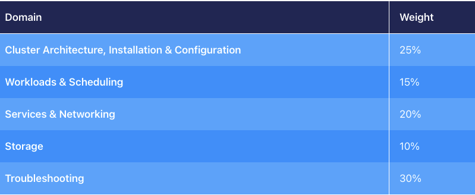
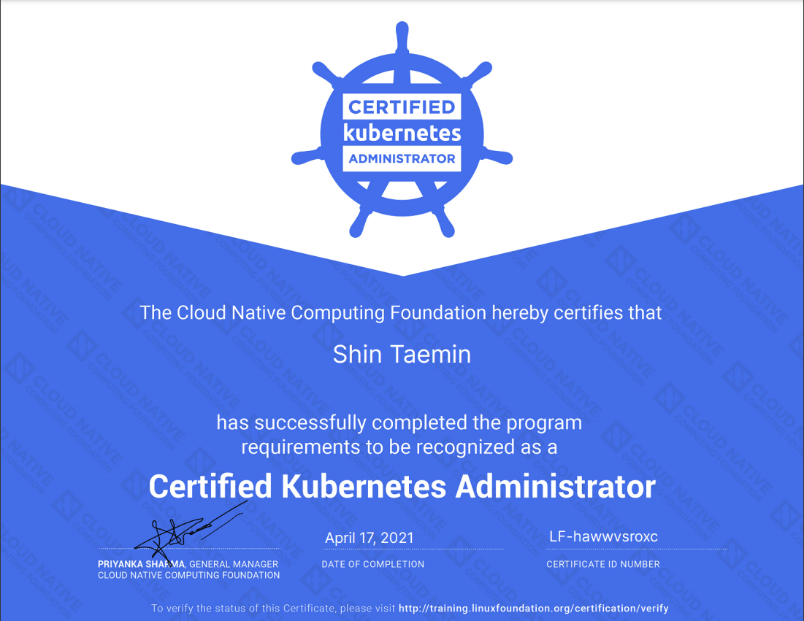

## 후기

* 이번 주 금요일(2021.04.16)에 신청만 해두고 미뤘던 CKA 시험을 결국 치뤘습니다. 원래는 그전 주 금요일에 보려고 했었는데 회사 회의실에서 회사 노트북으로 시험을 치루려고 하니 캠 및 화면 공유가 되지 않았습니다. \
  감독관이 알려준 vivalbi라는 웹 브라우저를 설치했는데도 문제가 해결되지 않아 이후 pre-flight 일정을 잡아 별도로 노트북 & 네트워크 환경을 체크한 후 동일한 노트북 & 네트워크 환경에서 시험을 보게 되었습니다.
* 위처럼 문제가 발생하여 스터디 룸을 빌려서 시험을 보았는데요. 제가 시험을 봤을 때는 감독관이 마스크를 벗고 시험을 볼 것을 요구하였습니다. 다행히도 마스크를 벗고 시험을 봐도 괜찮다고 허락을 받아 문제 없이 진행되었는데 개인 공간이 아닌 스터디 룸을 빌려 시험을 보실 분들이라면 해당 부분 확인하시는 것을 추천드립니다.
* 다른 후기에서와 마찬가지로 방의 360도 및 책상 아래, 그리고 책상 위의 물건, 핸드폰 및 전자기기(스마트워치) 착용 유무를 검사하였습니다. 스터디 룸에 TV 모니터가 있었는데, 전원 플러그도 뽑으라고 하였습니다.
* 오늘 날짜(2021.04.18) 기준으로 쿠버네티스 버전이 1.20인 환경에서 시험을 보았고 다들 추천하시는 유데미의 [Certified Kubernetes Administrator (CKA) with Practice Tests](https://www.udemy.com/course/certified-kubernetes-administrator-with-practice-tests/) 와 실무에서 쿠버네티스를 사용한 경험을 기반으로 시험을 보게 되었습니다.
* 시험 환경 확인 절차가 대략 30분 전후로 끝난 후 시험을 보았습니다. 위 링크의 mock exam보다 조금 더 어려운 수준의 문제가 나왔고 17문제에 2시간동안 문제를 풀었습니다. 개인적으로는 시간이 타이트하다고 느꼈습니다.
* 오늘 날짜(2021.04.18) 기준으로 나오는 문제의 비율은 다음과 같습니다. 자세한 내용은 [링크](https://www.cncf.io/certification/cka/) 를 참고해주세요.

* 저의 경우에는 20% 할인을 받아 240달러에 시험을 보았습니다. 가끔씩 할인을 하니 페이스북 k8s 한국 커뮤니티나 구글링을 통해 할인을 받을 수 있는지 확인하고 구입하시면 좋을 듯 합니다.

* 시험을 준비하며 쿠버네티스 구성 요소들의 전체적인 개관 및 kubectl의 imperative command에 많이 익숙해질 수 있었습니다. \
기존에는 공식 문서에서 쿠버네티스 메니페스트 파일의 예제를 가져다가 추가하는 형식이었는데, 이제는 CLI에서 뚝딱 만들어버려 시간 절약을 많이 할 수 있을 듯 합니다. \
또 간단한 트러블 슈팅 정도는 혼자 할 수 있겠다는 자신감이 생겼네요.
* 글의 맺음은 자격증으로 대신하겠습니다.

