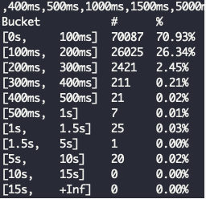

## 테스트, 그리고 이상 지표

최근에 하고 있는 업무가 기존에 운영하고 있는 어플리케이션 서버를 포팅하는 작업입니다.

서버를 포팅하며 기존과 바뀐 환경에서 정상적으로 어플리케이션 서버가 동작하는지 확인하기 위해 특정 HTTP API를 호출하는 간단한 부하 테스트를 진행했습니다. API를 호출하면 해당 서버(이하 A 서버)는 몇 개의 다른 API 서버(이하 B, C, D 서버)를 호출한 뒤 응답을 내려주는 형식입니다.

부하 테스트 도구로는 vegeta를 이용하였습니다.

(vegeta는 드래곤볼의 그 베지터가 맞습니다. vegeta는 오픈소스로 [github](https://github.com/tsenart/vegeta)에 올라와 있습니다.)

수행 결과, 모든 요청이 정상적으로 200 status code를 내려주고 레이턴시의 평균 응답 속도도 괜찮게 나온 것으로 보였는데 이상한 지표가 있었습니다.

latency의 p95, p99는 200~300ms인데 max(제일 오래 걸린 요청이)가 5초 초반대였습니다. 순간적으로 네트워크 상의 지연이 발생했나? 라는 생각을 가지며 -type=hist 옵션을 주어 특정 응답 시간에 얼마나 많이 몰려있는지를 확인했습니다.

별도로 스크린샷을 찍지는 않았지만 신기하게도 5s, 10s 구간에 해당하는 거의 대부분의 응답이 5초 초반대의 응답 시간을 기록했습니다. 그런데 이상했던건, 해당 문제가 발생한 시간대에서의 B, C, D 서버도 응답을 느리게 준 로그를 확인할 수 없었습니다. 그래서 어느 구간이 문제인지 찾기 위해 서버 호출 구간마다 로그를 심어 어디에서 요청이 늦게 가는 구간을 찾았습니다.

## 원인 분석 및 해결

해당 구간은 nodejs의 net 모듈을 이용하여 TCP로 메세지를 하나 보내고 메세지에 해당되는 응답을 받는 매우 간단한 로직인데 소켓을 재활용하지는 않고, 요청 시마다 소켓을 생성합니다. 소켓을 생성할 때는 도메인 주소를 이용하여 소켓을 생성합니다.

확실히 어플리케이션 로직 문제가 아님을 확인하기 위해 동일 로직을 하는 nodejs 서버(이하 E 서버), TCP echo 서버(이하 F 서버)를 만들어 E 서버에서 F 서버를 호출하고 테스트를 진행했습니다. 그리고 5초 지연이 발생하는 것을 재현하였습니다.

아까 위에 이야기했던 것처럼 TCP 메세지를 받는 서버에서는 요청을 받고 바로 응답하여 지연 시간이 아예 존재하지 않았기에 처음에는 nodejs의 net 모듈에서 관련된 이슈가 있었는지 확인했으나 별 다른 소득을 얻지 못했습니다.

HTTP 프로토콜로 필터를 걸고 와이어샤크로 확인했는데 재전송이 일어난 흔적도 확인할 수 없었습니다. 다만, A 서버에서 날린 요청이 5초 뒤에 도착하고, 그 직후 바로 응답이 내려가는 것을 확인할 수 있었습니다. (이 때 프로토콜을 HTTP로 필터링을 걸었기에 DNS와 관련된 패킷을 확인하지 못했습니다. 필터를 걸지 않았다면 좀 더 빠르게 해결할 수 있었겠네요.)

그래서 5초 지연을 키워드로 열심히 구글링을 하던 도중 다음과 같은 코멘트를 발견합니다.

도메인 주소를 이용해 소켓을 생성하는 부분을 IP로 사용하도록 변경 후 테스트를 진행하니 5초 초반대의 응답들이 모두 사라졌습니다. 레이턴시 또한 많이 개선됐는데, nodejs가 사용하는 getaddrinfo(3) 함수가 동기로 구현되어 있어, libuv의 쓰레드 풀을 모두 사용하는 경우가 발생할 때 성능 저하가 일어난 것으로 추정하고 있습니다. [(관련 링크)](https://nodejs.org/api/dns.html#dns_dns_lookup)

관련 내용을 찾아보니, 도메인 주소를 resolve할 때 별도 설정이 없으면 default timeout이 5초, retry가 2회라고 합니다. [(관련 링크)](http://man7.org/linux/man-pages/man5/resolv.conf.5.html)

이를 해결하기 위해서는 도메인 주소 대신 IP를 사용하거나, 어플리케이션 단에서 resolver를 사용하여 DNS를 캐싱하거나, OS 단에서 DNS를 캐싱하거나, /etc/resolv.conf의 설정을 변경하거나, 기존 연결된 소켓을 재사용하도록 로직을 변경하는 방법 등이 존재합니다. (OS 단에서 DNS를 캐싱하면, 질의할 때도 OS에서 DNS 질의를 가져오는 API를 사용해야 합니다.)

저의 경우에는 소켓을 재사용하지 않을 이유가 없는 것으로 보여 소켓을 재사용하도록 코드를 변경하여 해당 문제를 해결하였습니다.

## 결론

해당 문제를 해결하기까지 시간이 많이 걸렸던 것으로 기억하는데요. 아예 원인이 어디인지도 감을 못 잡았기에 이것저것 확인하고 시도하느라 오래 걸렸습니다. 단순히 동작하는 코드가 아니라 해당 코드가 어떻게 동작하는지, 어느 환경에서 돌아가고 있는지에 대해 좀 더 많은 고민을 해야겠다는 생각이 많이 들었습니다.