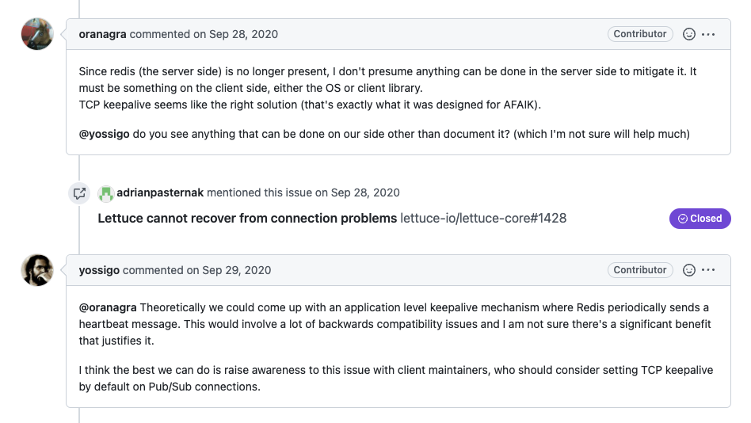

  
## 요약

redis는 client - server간 어플리케이션 단에서 별도로 heartbeat packet을 통해 커넥션 유효 여부를 판단하지 않는다 \
커넥션이 유효하지 않은지를 판단하려면 lettuce의 keepalive 옵션을 켜야 하는데 lettuce keepalive 옵션은 os(container) 설정을 따라가는 문제가 있다 \
이 문제점은 lettuce 6.1부터 도입된 lettuce extended keepalive 옵션을 통해 어플리케이션단에서 tcp keepalive 값을 커스터마이징하는 것을 통해 해결할 수 있다 \
따라서 subscribe, blpop 0 명령 등 서버로부터 응답이 오기까지 오래 걸릴 수 있는 명령을 수행하는 커넥션이 유효한지 원하는 시간 내에 판단할 수 있다(https://github.com/lettuce-io/lettuce-core/issues/1437)

## lettuce sentinel

lettuce 클라이언트는 sentinel를 통해 redis를 연결하면 sentinel로부터 마스터 / 레플리카 정보를 가져오고 이를 통해 마스터 혹은 레플리카 레디스와 통신한다 \
그리고 sentinel에 psubscribe * 명령어를 통해 failover 등의 이벤트가 발생하면 이를 통해 관련된 레디스 정보를 갱신한다(관련된 내용은 6.1.8 릴리즈 기준 io.lettuce.core.masterreplica.SentinelTopologyRefresh 클래스에서 확인할 수 있다)

하지만 이후 센티널에서 페일오버가 발생하였으나, lettuce 클라이언트가 이를 인지하지 못해 잘못된 레디스 정보를 가지고 레디스로 통신을 시도하는 이슈가 발생한 적이 있었다 \
이에 대한 원인을 찾던 도중 모종의 이유로 커넥션이 끊길 수가 있고 lettuce 클라이언트가 이를 인지하기 위해서는 lettuce extended keepalive 옵션을 사용해야 된다는 것을 알았다 \
그리고 l
redis 메인테이너는 관련해서 어플리케이션 단에서 heartbeat 패킷을 보내는 것은 하위호환성 이슈가 있어 redis 클라이언트 메인테이너가 pub / sub 명령은 기본적으로 레디스 클라이언트에서 tcp keepalive 설정을 할 수 있도록 해야 한다고 이야기하고 있다(https://github.com/redis/redis/issues/7855)

lettuce는 기본적으로 keepalive 옵션을 키면 os의 keepalive을 따라가고 있었다. \
이를 os 설정을 따라가는 것이 아닌 fine-grained한 설정이 가능하도록 6.1부터 extended keepalive 옵션을 추가해주었다 \
이를 통해 커넥션이 유효하지 않은 경우 다시 커넥션을 맺는 등의 액션을 취할 수 있다(reconnect 옵션이 켜져있으면 connectionWatchDog에 의해 다시 연결된다) \
따라서 위와 같이 sentinel를 통해 redis를 연결하거나, 혹은 pub / sub, 오래 대기하는 명령어를 사용하는 경우는 위 옵션을 적용하자

## 여담

lettuce extended keepalive 옵션을 사용해도, 커넥션이 유효하지 않은 상태가 있을 수 있다. 이 때 페일오버가 발생하고 후에 커넥션이 복구되어도 이벤트가 발생하기 전까지 센티널로부터 레디스 정보를 가져오지 않기에 관련되어 이슈를 제보한 상황이다([관련 링크](https://github.com/lettuce-io/lettuce-core/issues/2007)) \
이를 처리할 방법이 어려울 것 같다고 계속 open되어 있는 상황이다